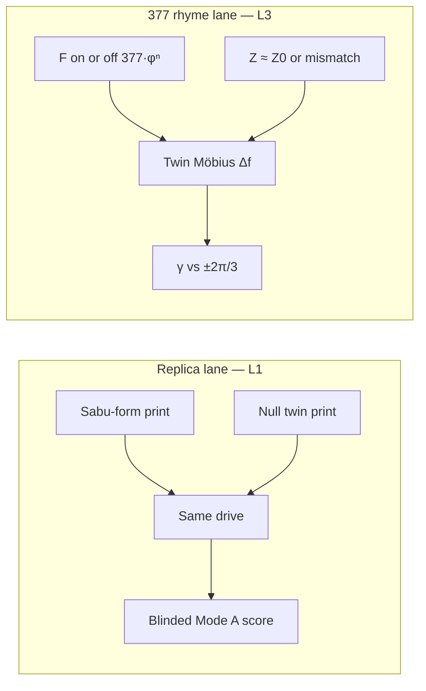
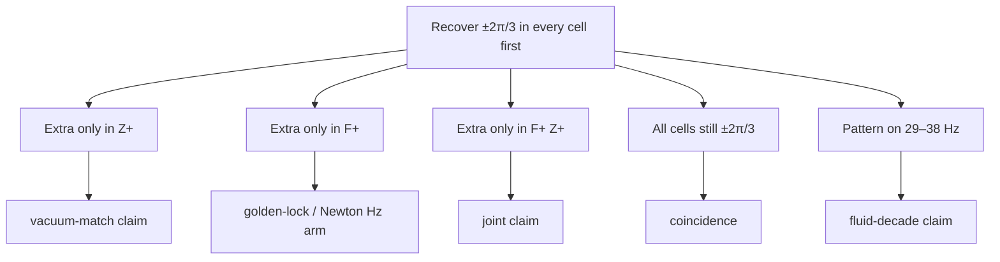
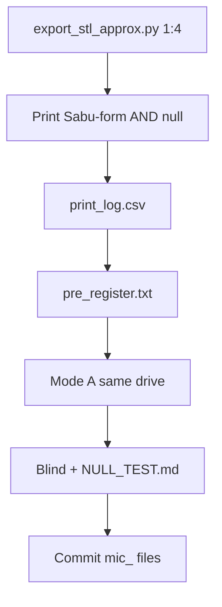

# Sabu Disk — open replication & acoustic tests

**Egyptian Museum, Cairo · JE 71295** · Mastaba S3111, Saqqara · First Dynasty (c. 3000–2800 BC)  
Discovered 19 January 1936 by Walter B. Emery

> **Status: protocol frozen.** Teaching sims labelled. **No `mic_` results yet.**  
> This is **not** a certificate of ancient “resonance technology.” Function of the original remains unknown.  
> Next work is a print + blinded Mode A session — not more documents.

Open tools to **copy the published form** and run **honest shape-vs-null acoustic comparisons**.

| Read | File |
| --- | --- |
| Museum form | this README → [Museum facts](#museum-facts) |
| 377 Hz / Z₀ discriminator | [docs/BERRY_377.md](docs/BERRY_377.md) |
| Who owns which claim | [docs/citation_sheet.md](docs/citation_sheet.md) |
| Print + mic | [Physical path](#physical-path-one-pass) |

## Two tests (do not mix)



Replica lane answers: *does this shape differ from a null under the same drive?*  
Rhyme lane answers: *does extra holonomy track Hz, Ω, both, or neither?*  
A peak on a teaching FFT is neither answer.



---

## Who this is for

| You… | Start here |
| --- | --- |
| Want the museum facts only | [Museum facts](#museum-facts) |
| Want the 377 Hz / Z₀ discriminator | [docs/BERRY_377.md](docs/BERRY_377.md) |
| Want to generate a printable mesh | [Quick start](#quick-start) → STL step |
| Have a printer + mic | [Physical path](#physical-path-one-pass) |
| Are reviewing claims | [Claim hygiene](#claim-hygiene) |
| Just browsing | Read status line above — no action required |

No printer? You do **not** need to generate STLs or run acoustics.

---

## Museum facts

| Property | Value | Source |
| --- | --- |
| Outer diameter | **61 cm** | Emery 1949 |
| Maximum height | **10.6 cm** | Emery 1949 |
| Central hole | **~8 cm** | Museum descriptions |
| Material | Weakly metamorphic **siltstone** (historically “schist”) | Emery / catalogues |
| Form | Shallow bowl; three lobes folded **inward** toward a central socket; outer rim as narrow arches between lobes | Emery 1949 Fig. 58 |

**Plain form:** not a gear. A thin-walled stone *bowl* with three curved wings bent toward a tubular centre.

- Emery, W. B. (1949). *Great Tombs of the First Dynasty*, Vol. 1. Cairo: Government Press, Fig. 58.  
- El-Khouli, A. (1978). *Egyptian Stone Vessels*, Vol. 2 no. 5586; Vol. 3 pls. 135, 158.

---

## Claim hygiene

| Layer | What belongs here |
| --- | --- |
| **L1 — instrument** | Mic traces, measured print dimensions, blinded null scores |
| **L2 — literature tools** | FFT, PIV ideas, standard acoustics |
| **L3 — framework** | Optional 377 Hz drive (Newton); Z₀ rhyme (this repo) |

- Scripts under `code/fft_sweep.py`, `code/piv_simulation.py`, and files in `data/` **without** a `mic_` prefix are **simulations / teaching** — not microphone data.
- A real band claim needs: print → fixed drive → **null twin** → `analyze_mic.py` → blinded score ([docs/NULL_TEST.md](docs/NULL_TEST.md)).
- Printing proves **form is reproducible**. It does not prove resonance or purpose.

---

## Quick start

```bash
git clone https://github.com/SunWolf77/sabu-disk-377hz.git
cd sabu-disk-377hz
pip install -r requirements.txt

# Optional: printable meshes (stdlib only)
python code/export_stl_approx.py --scale 0.25 --out STL
# → STL/sabu_approx_1to4.stl + STL/null_twin_1to4.stl

# Teaching simulations (not physical data)
python code/fft_sweep.py
python code/piv_simulation.py

# After a real recording
python code/analyze_mic.py path/to/mic_run.wav --f0 377 --half 2
python code/analyze_mic.py mic_a.wav mic_b.wav --compare
```

### Physical path (one pass)



1. **Generate STLs** — `python code/export_stl_approx.py --scale 0.25 --out STL`  
2. **Print** — [docs/REPLICA.md](docs/REPLICA.md) (Sabu-form **and** null twin)  
3. **Log** — [templates/print_log.csv](templates/print_log.csv)  
4. **Pre-register** — [templates/pre_register.txt](templates/pre_register.txt)  
5. **Acoustics** — [docs/ACOUSTIC_TEST.md](docs/ACOUSTIC_TEST.md) (Mode A)  
6. **Blind & score** — [docs/NULL_TEST.md](docs/NULL_TEST.md)  
7. **Commit** — [docs/REPLICATION.md](docs/REPLICATION.md)

Details for mesh commit: [STL/README.md](STL/README.md).

---

## What’s in the box

```
code/
  export_stl_approx.py           # Sabu + null STLs (Python stdlib)
  openscad/sabu_disk_approx.scad # finer parametric model
  analyze_mic.py                 # Mode A metric from WAV / CSV
  acoustic_logger.ino            # relative multi-mic stream
  fft_sweep.py · piv_simulation.py   # SIM only
docs/                            # protocols — see docs/README_docs.md
STL/                             # generate meshes here
templates/                       # print log + pre-register
data/                            # SIM unless filename is mic_*
```

| Doc | Role |
| --- | --- |
| [docs/BERRY_377.md](docs/BERRY_377.md) | 377 Hz / Z₀ holonomy 2×2 · Möbius ±2π/3 |
| [docs/citation_sheet.md](docs/citation_sheet.md) | Who owns what · Emery, Newton, Sheppard |
| [docs/REPLICA.md](docs/REPLICA.md) | Dimensions, supports, what a print may claim |
| [docs/ACOUSTIC_TEST.md](docs/ACOUSTIC_TEST.md) | Mode A forced response · Mode B eigenmodes |
| [docs/NULL_TEST.md](docs/NULL_TEST.md) | Blind protocol + kill rule |
| [docs/REPLICATION.md](docs/REPLICATION.md) | How to add a run without breaking hygiene |
| [docs/README_docs.md](docs/README_docs.md) | Docs map |

---

## 3D printing (short)

```bash
python code/export_stl_approx.py --scale 0.25 --out STL
```

- Prefer that exporter or `code/openscad/sabu_disk_approx.scad` — **not** any `*placeholder*` mesh.
- Bowl up; supports under lobe undersides only; keep kidneys and hub bore open.
- PLA ≠ siltstone. Log mass, walls, measured Ø with every acoustic run.

Full notes: [docs/REPLICA.md](docs/REPLICA.md).

---

## Acoustic testing (short)

| Mode | Question |
| --- | --- |
| **A — forced response** | Under the same drive, does Sabu-form differ from the null twin in a chosen band? |
| **B — eigenmodes** | What does *this print* ring at when struck? |

**377 Hz** may be used as a drive (Newton’s Fibonacci-target **proposal**). It is **not** a museum label and **not** a Z₀ measurement. Publish Sabu and null numbers together.

---

## Highest-leverage next step

Whoever has a printer: **1:4 Sabu + null → one blinded Mode A session → commit `mic_` files + filled templates.**  
Until then this repo is a **protocol + teaching sims**. After that, it is a **bench**.

---

## Attribution

**This repository** — Ben Rowe ([@SunWolf77](https://github.com/SunWolf77)): replica, null test, scripts, Z₀-as-second-map question.

**Cited sources — not co-authors, not implied endorsement.**

| Source | Take | Do not attribute |
| --- | --- | --- |
| Emery 1949 · JE 71295 | Form, find, dimensions | Resonance, 377 Hz, function |
| Newton, *Tesla Towers 377* | 377 Hz as optional Fibonacci drive | Z₀, replica protocol, disk function |
| Sheppard, SUPT | Proxy / remeasurement stance | Disk function; Hz = Ω |

Full table: [docs/citation_sheet.md](docs/citation_sheet.md).

## License

MIT. Cite **JE 71295** and **Emery 1949** when publishing replicas or acoustic results. If you use 377 Hz as the drive, cite **Newton, *Tesla Towers 377***. If you use the Z₀ / holonomy discriminator, cite this repo.
